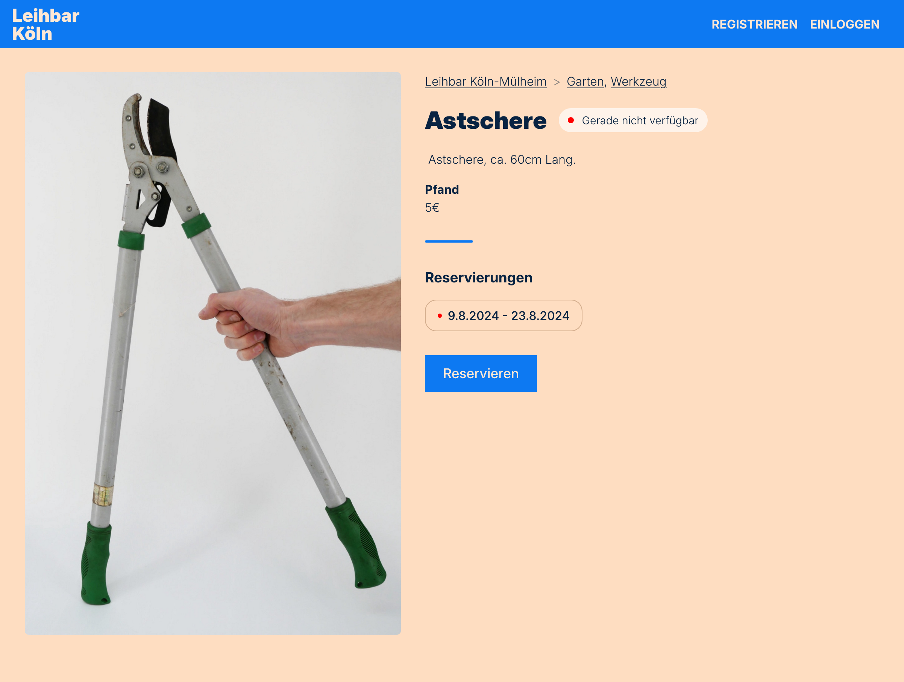

# Leihbase

Web application to manage Leihladen, also known as Borrow Stores.

> [!IMPORTANT]  
> This software is still in active development. It is being used in production
> for the [Leihbar in Cologne](https://leihbar-koeln.de/), but might be lacking
> some (for you) critical features.

## Features

- 🏪 A webshop front-end showing borrowable products
- 🏙️ Manage multiple borrow locations
- 🏷️ Product category filtering
- 🧑‍🤝‍🧑 User sign-up/login
- 🎫 Product reservations
- 👷 A back-end to manage reservations

## Screenshots

## Tech

- Back-end and API using [PocketBase](https://pocketbase.io/)
- Front-end with server-side rendering using [NuxtJS](https://nuxt.com/)

## Deployment

The repository contains [fly.toml](https://fly.io/docs/reference/configuration/)
files to deploy the service as [fly.io](https://fly.io) applications, but can be
deployed to any server where Docker containers can run.

## Development

### Setup

Requirements: [Docker](https://www.docker.com/)

- `$ docker compose build`
- `$ docker compose up`

### Initial content

After starting the service using the setup steps above. Enter some initial data
to be able to use the application:

1. Browse to http://localhost:8080/\_/ to visit the Pocketbase admin interface
1. Create an admin account
1. Create a location in the locations collection (make sure to set the location
   to as 'active')
1. Create a product in the products collection (make sure to set the product to
   as 'active')
1. Now you should be able to visit http://localhost:3000 to visit the front-end

### E-mail

When starting the service with docker-compose, a
[mailhog](https://hub.docker.com/r/mailhog/mailhog) container starts as well. In
Pocketbase (http://localhost:8080/\_/ > Settings > Mail settings) the following
SMTP values can be configured:

- SMTP server host: mailhog
- Port: 1025
- Username: _\<empty>_
- Password: _\<empty>_

Any sent e-mail can then be viewed in the mailhog web interface at
http://localhost:8025.

## Tests

Tests are configured and run using [Playwright](https://playwright.dev/).

### Setup

- `$ cd tests`
- `$ pnpm install`
- `pnpm exec playwright install`

### Run

- `pnpm run test`
